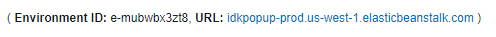
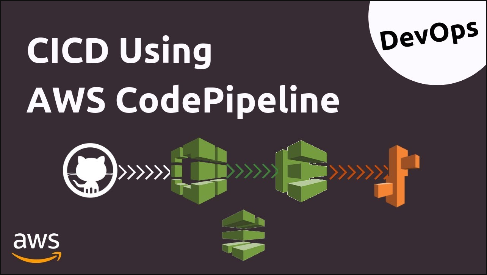

># How to configure and deploy this website
polarcloud.consulting is a website built using:
* ```Github``` as a source code repository.
* ```Visual Studio Code``` as its runtime.
* ```.NET Core MVC 2.2``` as its runtime.
* ```Bootstrap``` for responsive mobile design.
* ```HTML``` for design.
* ```CSS``` for styling.
* ```AWS``` for hosting.
* ```Route53``` for DNS.
* ```IAM``` for access policies.
* ```Elastic Beanstalk``` for management of website infrastructure.
* ```EC2``` to host the website.
* ```Elastic Load Balancer``` for traffic routing.
* ```Docker``` for containerization.
* ```CodePipeline``` For deployment of new versions of the website.

This document guides the reader through setting up and running the https://polarcloud.consulting website in a new AWS account.

<br><br>
># Install .NET Core 2.2
https://dotnet.microsoft.com/download/dotnet-core/2.2
<br><br>
># Install Visual Studio Code
https://code.visualstudio.com/download
<br><br>
># Install AWS CLI
https://s3.amazonaws.com/aws-cli/AWSCLISetup.exe
<br><br>
># Configure AWS CLI
In IAM, add a temporary user and attach the policy ```AdministratorAccess```. 

Create new Security Credentials.

Create or update file ```c:\.aws\config``` and add a profile

Sample config:
``` config
[polarCloudAdmin]
aws_access_key_id=
aws_secret_access_key=
region=us-west-1
```
Update the CLI to use the profile
``` cli
aws config
```

<br><br>
># Fork this repository
Fork this repository on GitHub as updates need to be made for new AWS accounts

># Remove or Update to your Google Analytics account
In ```Visual Studio Code```, search for and replace the google analytics html tags:

 ```Ctrl+Shift+F```. Paste ```<script async src="https://www.googletagmanager.com/gtag/js?id=UA-151946230-1"></script>```. Press ```enter```
<br>
Replace all references.

<br><br>
># Create an SSL Certificate
``` cli
aws request-certificate --domain-name {your domain name} --subject-alternative-names *.{your domain name}
```
Once created, obtain the CertificateArn for the domain.
``` cli
aws acm list-certificates
```
This will be used to override the .ebextensions/app.config file
<br><br>
># .ebextensions
This repository contains an Elastic Beanstalk configuration file which will need to be overwritten. The ```app.config``` localetdlocated in ```/.ebextensions```. 

Update ```app.config:``` by overriding ```SSLCertificateId```
```config
option_settings:
    aws:elasticbeanstalk:cloudwatch:logs:
        StreamLogs: true
    aws:elasticbeanstalk:environment:
        ServiceRole: 
    aws:autoscaling:asg:
        MaxSize: 1
    aws:elb:listener:443:
        ListenerProtocol: HTTPS
        SSLCertificateId: {override with value from CertificeArn}
        InstancePort: 80
        InstanceProtocol: HTTP
    aws:elb:listener:
        ListenerEnabled: false

```
<br><br>
># Setup Elastic Beanstalk Environment
run the following commands
```cli
eb create polarCloud-Web-Dev -i t2.micro
```
<br><br>
># Expected Output

Environment Name: ```polarCloud-Web-Dev```

## Expetected EB Capacity Settings
Elastic Beanstalk Environment type: ```load balanced```

Instances: ```min 1 max 1```

## Expected EB Load Balancer Settings
Load Balancer Type: *classic*
Port | Protocol | Instance Port | Instance protocol | SSL certificate
-----|----------|---------------|-------------------|------
*80* | *HTTP* | *80* | *HTTP* | --
*443* | *HTTPS* | *80* | *HTTP* | ```{SSL Certificate Name From Certificate Manager}```

## Expected IAM Roles Created
* ```aws-elasticbeanstalk-ec2-role```
* ```aws-elasticbeanstalk-service-role```

## Expected EC2 Instance Created
Name | Instance ID | Instance Type
-----|-------------|--------------
polarCloud-Web-Dev | Instance ID | t2.micro 

## Expected Security Groups Created
Name | Description
-----|------------
polarCloud-Web-Dev | Elastic Beanstalk created security group used when no ELB security groups are specified during ELB creation
PolarCloud-Web-Dev | SecurityGroup for ElasticBeanstalk environment

># Update Source Code
Create a bucket in ```S3```.

Update ```/Services/RegisterS3ContactService.cs``` to use the name of your bucket.
``` c#
private const string bucketName = {bucket-name};
```

<br><br>
># Debugging and Deploying
Open ```Visual Studio Code```, select file->open and chose the path to your fork.

Debug by pressing ```Ctrl+5```.

># Containerization
``` cli
open a new terminal
docker build . -t polarcloud
docker-compose up
open a new terminal
curl http://localhost:80
```
Navigate your browser to http://localhost:80 and ensure Docker is serving the website.

># Zip Source Code

>Zip source in PowerShell
```
compress-archive -path '.' -destinationpath '.\Site.zip' -compressionlevel fastest
```
>Zip source on Linux/Mac
```
zip -r archive_name.zip folder_to_compress
```
<br><br>
># Create Application Source Bundle

```
git archive -v -o Site.zip --format=zip HEAD
git checkout master
eb use polarCloud-Web-Dev
```
<br><br>
># Deploy to Elastic Beanstalk
```
git add .
eb deploy --staged
git tag -a {version-string}
```
This will open a VI editor. Type the folowing
```editor
i
V1
esc
x!
enter
```

># Clean Up Zip
``` cli
rm Site.zip
```

Check deployment was successful in the Elastic Beanstalk console. Click on the url:


<br><br>
<br><br>
<br><br>
># DevOps

># CICD
Here we use ```AWS CodePipeline``` to To build, test and deploy code through various stages. Our pipeline has 4 stages and was consturcted using the AWS Console. Before creating a new pipeline, updated `buildspec.yml` by changing your accountId:

```Example
build:
    commands:
      - echo Building the Docker image...
      - docker build -t {account-id}.dkr.ecr.us-west-1.amazonaws.com/polarcloud-web:latest .
  post_build:
    commands:
      - echo Pushing the Docker images...
      - $(aws ecr get-login --no-include-email --region us-west-1)
      - docker push {account-id}.dkr.ecr.us-west-1.amazonaws.com/polarcloud-web:latest  
```

Here is the expected setup when cxreating a new pipeline:

Pipeline Name: `polarCloud-Web-Pipeline`

`New Service Role`

[x] Allow AWS CodePipeline to create a service role so it can be used with this new pipeline

`Next`

Source: `GitHub`

`Next`

Build provider: `AWS CodeBuild`

`Create Project`

Project Name: `polarCloud-Web-Deploy`

Environment Image: `Managed Image`

Operation System: `Ubuntu`

Runtimes: `Standard`

Privalged: `Checked`

Image: `aws/codebuild/standard:2.0

Service Role: `New service role`

Buildspec: `Use a buildspec file`

`Continue to Codepipeline`

`Next`

Deploy Provider: `AWS Elastic Beanstalk`

Input artifacts: `SourceArtifact`

Application Name: `polarCloudWeb`

EnvironmentName: `polarCloud-Web-Dev`

`Create pipeline`

You should now see the pipeline building. 

If the build fails, try adding the following policy to the service role created by pipelines (polarCloud-Web-Build-service-role):
``` policy
{
    "Version": "2012-10-17",
    "Statement": [
        {
            "Sid": "VisualEditor0",
            "Effect": "Allow",
            "Action": [
                "ecr:GetAuthorizationToken",
                "ecr:InitiateLayerUpload",
                "ecr:CompleteLayerUpload"
            ],
            "Resource": "*"
        }
    ]
}
```

If the deployment fails, try attaching the `AmazonS3FullAccess` following polocy to the service role created by pipelines for `deployment` (polarCloud-Web-Build-service-role):

To extend the production pipeline, create a new environment:

``` cli
eb create polarCloud-Web -i t2.micro
```

Edit the pipeline and `Add stage` called `ManualApproval` (this would be removed after including automated tests).

Add an `Action Group`

Action Name: `ManualApproval`

Action Provider: `Manual Approval`

`Done`

Add another stage `Add stage` called `Deploy-Prod`

Add an `Action Group`

Action Name: `Deploy-Prod`

Action Provider: `AWS Elastic Beanstalk`

Input artifacts: `SourceArtifact`

Application name: `polarCloudWeb`

Environment name: `polarCloud-Web-Prod`

`Done`

<br><br>
># Backend
When receiving a contact on the polarcloud.com landing page, the site adds the contact to a database (S3), to a marketing and analytics platform (Amazon Pinpoint) and notifies polarCloud Consulting's via email and SMS. 

To deploy the backend, please refer to the ```READ.md``` in the backend repository https://github.com/polar-cloud/polarcloud-backend


