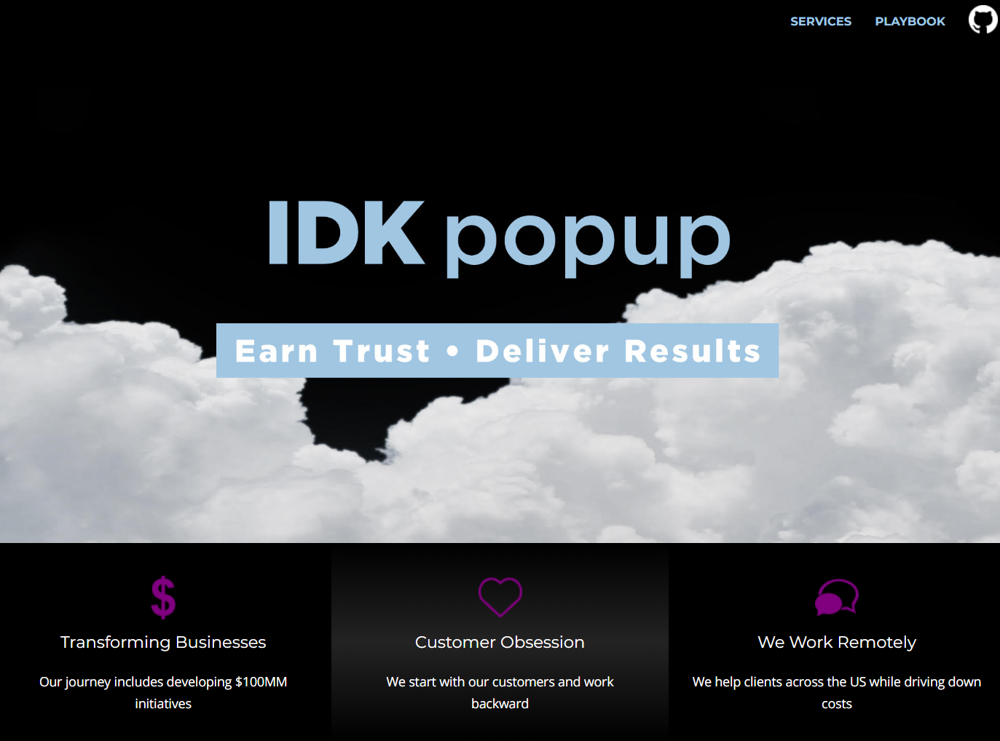

># How to configure and deploy this website
IDK popup is a website built leveraging:

* ```Github``` as a source code repository.
* ```Visual Studio Code``` as an IDE.
* ```.NET Core 3.1``` as its runtime.
* ```Bootstrap``` for responsive mobile design.
* ```HTML``` for design.
* ```CSS``` for styling.
* ```Docker``` for containerization.
* ```AWS``` for hosting.
* ```Route53``` for DNS.
* ```IAM``` for access policies.
* ```Elastic Beanstalk``` for management of website infrastructure.
* ```EC2``` to host the website.
* ```Elastic Load Balancer``` for traffic routing. 
* ```S3``` for storage.
* ```Lambda``` for backend processing.
* ```Pinpoint``` for digital customer engagement.
* ```CodePipeline``` for the deployment of new versions of the website.

This document guides the reader through setting up and running the https://idkpopup.com website in a new AWS account.
It demonstrates building on top of AWS using a fully managed build and host stack.

The backend records registrants to S3 for storage and Pinpoint for customer engagement. 



<br><br>
># Install .NET Core 3.1
https://dotnet.microsoft.com/download/dotnet-core/3.1
<br><br>
># Install Visual Studio Code
https://code.visualstudio.com/download
<br><br>
># Install AWS CLI
https://s3.amazonaws.com/aws-cli/AWSCLISetup.exe
<br><br>
># Configure AWS CLI
In IAM, add a temporary user and attach the policy ```AdministratorAccess```. 

Create new Security Credentials.

Create or update file ```c:\.aws\credentials``` adding a profile

Sample config:
``` config
[IDKpopup-website]
aws_access_key_id=
aws_secret_access_key=
region=us-west-1
```
Update you Environment Variable to use the profile

Windows:
``` windows
setx AWS_PROFILE IDKpopup-website
```

Mac:
``` Mac
export AWS_PROFILE=IDKpopup-website
```

Reload your terminal
<br><br>
># Fork this repository
Fork this repository on GitHub as updates need to be made for new AWS accounts

<br><br>
># Pull in packages
From terminal in Visual Studio run:
```
dotnet restore
```

<br><br>
># Remove or Update to your Google Analytics account
In ```Visual Studio Code```, search for and replace the google analytics html tags:

 ```Ctrl+Shift+F```. Paste ```UA-158109460-1```. Press ```enter```
<br>
Replace all references with your GA ID

<br><br>
># Create an SSL Certificate
``` cli
aws acm request-certificate --domain-name {your domain name} --subject-alternative-names *.{your domain name}
```
Once created, approve the validation email and obtain the ```CertificateArn``` for the domain. This will be used to override the .ebextensions/app.config file

<br><br>
># .ebextensions
This repository contains an Elastic Beanstalk configuration file which will need to be overwritten. The ```app.config``` localetdlocated in ```/.ebextensions```. 

Update ```app.config:``` by overriding ```SSLCertificateId```
```config
option_settings:
    aws:elasticbeanstalk:cloudwatch:logs:
        StreamLogs: true
    aws:elasticbeanstalk:environment:
        ServiceRole: 
    aws:autoscaling:asg:
        MaxSize: 1
    aws:elb:listener:443:
        ListenerProtocol: HTTPS
        SSLCertificateId: {override with value from CertificeArn}
        InstancePort: 80
        InstanceProtocol: HTTP
    aws:elb:listener:
        ListenerEnabled: false

```
<br><br>
># Create CloudWatch LogGroup
```cli
aws logs create-log-group --log-group-name idkpopup-website
```
<br><br>
># Initialize Elastic Beanstalk
``` eb init -i
eb init

2) us-west-1: US West (N. California)
Application Name: idkpopup-website
It appears you are using Docker. Is this correct? (Y/n): Y
Select a platform version.: 1
Do you wish to continue with CodeCommit? (y/N) (default is n): N
Do you want to set up SSH for your instances? (Y/n): N
```

Create the Elastic Beanstalk Environment
```cli
eb create IDKpopup-website -i t2.micro
```
<br><br>
## Expected Output

Environment Name: ```IDKpopup-website```

## Expetected EB Capacity Settings
Elastic Beanstalk Environment type: ```load balanced```

Instances: ```min 1 max 1```

## Expected EB Load Balancer Settings
Load Balancer Type: *classic*
Port | Protocol | Instance Port | Instance protocol | SSL certificate
-----|----------|---------------|-------------------|------
*80* | *HTTP* | *80* | *HTTP* | --
*443* | *HTTPS* | *80* | *HTTP* | ```{SSL Certificate Name From Certificate Manager}```

<br><br>
># Create Contacts Buket
Create a bucket in `S3` to hold contacts that register on the website.
``` cli
aws s3api create-bucket --bucket {bucket-name} --region us-west-1 --create-bucket-configuration 
aws s3api put-object --bucket {bucket-name} --key contacts/web/  
```
For simplicity, we won't split out Development and Production buckets. The code can be modified to use environment variables for the proper separation of environments.

<br><br>
># Update Source Code

Update ```/Services/RegisterS3ContactService.cs``` to use the name of your bucket.
``` c#
private const string bucketName = {bucket-name};
```


<br><br>
># Debugging and Deploying
Open ```Visual Studio Code```, select file->open and chose the path to your repository.

Debug by pressing `Ctrl+F5`.

Ensure the site loads and that navigation is working.

Stop debugging by pressing `Shifty+F5`

># Containerization
``` cli
open a new terminal
docker build . -t idkpopup-website:latest
docker run -it --rm -p 8080:80 idkpopup-website:latest
open a new terminal
curl http://localhost:8080
```
Navigate your browser to http://localhost:8080 and ensure Docker is serving the website.

># Zip Source Code

>Zip source in terminal on Windows
```
compress-archive -path '.' -destinationpath '.\Site.zip' -compressionlevel fastest
```
>Zip source on Linux/Mac
```
zip -r archive_name.zip folder_to_compress
```
<br><br>
># Create Application Source Bundle

```
git archive -v -o Site.zip --format=zip HEAD
git checkout master
eb use IDKpopup-website
```
<br><br>
># Deploy to Elastic Beanstalk
```
git add .
eb deploy --staged
git tag -a {version-string}
```
This will open a VI editor. Type the folowing
```editor
i
V1
esc
x!
enter
```

># Clean Up
``` cli
rm Site.zip
```

Check deployment was successful in the Elastic Beanstalk console. Click on the url:

># At time of writing, CodeBuild does not support .NET Core 3.1. 
># The information below is expected to work with AWS support. 
># To release new version of the website, please update manually in ElasticBeanstalk.
<br><br><br><br><br><br><br><br><br><br><br><br><br><br>

># DevOps

># CICD
Here we use ```AWS CodePipeline``` to pull from GitHub, build, and deploy the website. This guide does not show test stages or multiple ElasticBeanstal environments for blue/green deployment. This pipeline has 4 stages and was consturcted using the AWS Console. Before creating a new pipeline, updated `buildspec.yml` by changing your accountId:

```Example
build:
    commands:
      - echo Building the Docker image...
      - docker build -t {account-id}.dkr.ecr.us-west-1.amazonaws.com/idkpopup-web:latest .
  post_build:
    commands:
      - echo Pushing the Docker images...
      - $(aws ecr get-login --no-include-email --region us-west-1)
      - docker push {account-id}.dkr.ecr.us-west-1.amazonaws.com/idkpopup-web:latest  
```

Navigate to `CodePipeline` and create a new pipeline.

Pipeline Name: `IDKpopup-website`

Click `New Service Role`

[x] Allow AWS CodePipeline to create a service role so it can be used with this new pipeline

Click `Next`

Source: `GitHub`

Click `Connect to GitHub`.

Repository: {your-repository}

Branch: master

Click `Next`

Build provider: `AWS CodeBuild`

Click `Create Project`

Project Name: `IDKpopup-website`

Environment Image: `Managed Image`

Operation System: `Ubuntu`

Runtimes: `Standard`

Privalged: `Checked`

Image: `aws/codebuild/standard:3.0

Service Role: `New service role`

Buildspec: `Use a buildspec file`

Click `Continue to Codepipeline`

Click `Next`

Deploy Provider: `AWS Elastic Beanstalk`

Input artifacts: `SourceArtifact`

Application Name: `website-frontend`

EnvironmentName: `IDKpopup-website`

`Create pipeline`

## Here CodeBuild will fail as it doesn't yet support .NET 3.1. AWS will support it in the near future.

You should now see the pipeline building. 

Edit the pipeline and `Add stage` called `ManualApproval` (this would be removed after including test automation).

Add an `Action Group`

Action Name: `ManualApproval`

Action Provider: `Manual Approval`

Click `Done`

Add another stage `Add stage` called `Deploy-Prod`

Add an `Action Group`

Action Name: `Deploy-Prod`

Action Provider: `AWS Elastic Beanstalk`

Input artifacts: `SourceArtifact`

Application name: `IDKpopup-website`

Environment name: `IDKpopup-website-production`

Click `Done`

># Contacts and Logging
To ensure the website can write contacts to S3 and record logs to CloudWatch, add `S3FullAcess` and `CloudWatchFullAccess` to the `aws-elasticbeanstalk-ec2-role`.

># Prod routing
You can now create an `A record` in `Route53` or your DNS provider to point to the given URL found in the `AWS Elastic Beanstalk` console.

Example A record:<br>


<br><br>
># Lambda Backend [Contact Registration]
When receiving a contact on the idkpopup.com landing page, the site adds the contact to a database (S3), to a marketing and analytics platform, Amazon Pinpoint, and notifies IDK popup via email and SMS. 

To deploy the backend, please refer to the ```README.md``` in the backend repository https://github.com/idkpopup/website-backend


